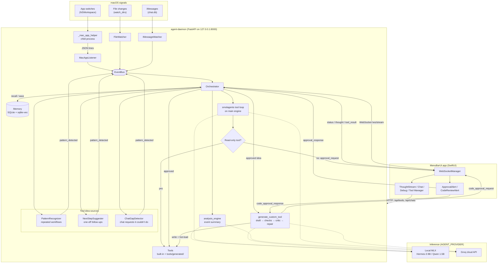
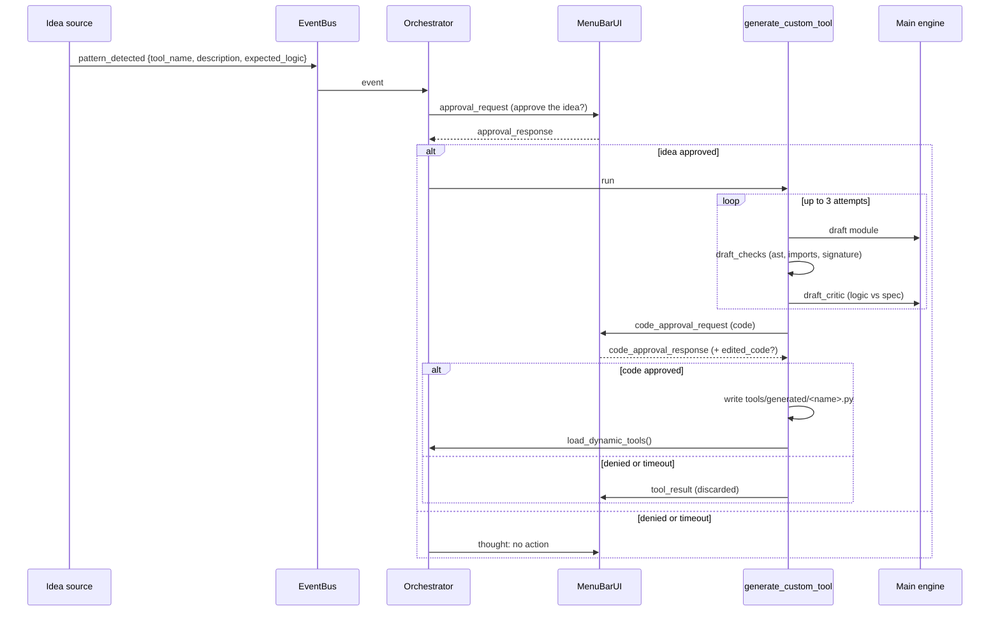

# How bot-inator works

## Components and event flow

```mermaid
flowchart TB
    subgraph mac["macOS signals"]
        APP["App switches<br/>(NSWorkspace)"]
        FS["File changes<br/>(watch_dirs)"]
        IM["iMessages<br/>(chat.db)"]
    end

    subgraph daemon["agent-daemon (FastAPI on 127.0.0.1:8000)"]
        HELPER["_mac_app_helper<br/>child process"]
        MAL["MacAppListener"]
        FW["FileWatcher"]
        IMW["IMessageWatcher"]
        BUS(["EventBus"])

        ORCH["Orchestrator"]
        ANALYSIS["analysis_engine<br/>event summary"]
        MEM[("Memory<br/>SQLite + sqlite-vec")]
        AGENT["smolagents tool loop<br/>on main engine"]
        GATE{"Read-only tool?"}
        TOOLS["Tools<br/>built-in + tools/generated/"]

        subgraph ideas["Tool-idea sources"]
            PR["PatternRecognizer<br/>repeated workflows"]
            NSS["NextStepSuggester<br/>one-off follow-ups"]
            CGD["ChatGapDetector<br/>chat requests it couldn't do"]
        end
        META["generate_custom_tool<br/>draft → checks → critic → repair"]
    end

    subgraph llm["Inference (AGENT_PROVIDER)"]
        MLX["Local MLX<br/>Hermes-3 8B / Qwen 1.5B"]
        GROQ["Groq cloud API"]
    end

    subgraph ui["MenuBarUI.app (SwiftUI)"]
        WSM["WebSocketManager"]
        VIEWS["ThoughtStream / Chat /<br/>Debug / Tool Manager"]
        ALERTS["ApprovalAlert /<br/>CodeReviewAlert"]
    end

    APP --> HELPER -->|JSON lines| MAL --> BUS
    FS --> FW --> BUS
    IM --> IMW --> BUS

    BUS --> ORCH
    ORCH --> ANALYSIS
    ORCH <-->|recall / save| MEM
    ORCH --> AGENT --> GATE
    GATE -->|yes| TOOLS
    GATE -->|no: approval_request| WSM
    ALERTS -->|approval_response| ORCH
    ORCH -->|approved| TOOLS

    ORCH --> PR & NSS & CGD
    PR & NSS & CGD -->|pattern_detected| BUS
    ORCH -->|approved idea| META
    META -->|code_approval_request| WSM
    ALERTS -->|code_approval_response| META
    META -->|write + hot-load| TOOLS

    ANALYSIS & AGENT & META -.-> MLX
    ANALYSIS & AGENT & META -.-> GROQ

    ORCH -->|status / thought / tool_result| WSM
    WSM <-->|"WebSocket /ws/stream"| ORCH
    WSM --> VIEWS & ALERTS
    VIEWS -->|"HTTP: /api/tools, /api/chats"| daemon
```

## New-tool lifecycle

```mermaid
sequenceDiagram
    participant Src as Idea source
    participant Bus as EventBus
    participant Orch as Orchestrator
    participant UI as MenuBarUI
    participant Meta as generate_custom_tool
    participant LLM as Main engine

    Src->>Bus: pattern_detected {tool_name, description, expected_logic}
    Bus->>Orch: event
    Orch->>UI: approval_request (approve the idea?)
    UI-->>Orch: approval_response
    alt idea approved
        Orch->>Meta: run
        loop up to 3 attempts
            Meta->>LLM: draft module
            Meta->>Meta: draft_checks (ast, imports, signature)
            Meta->>LLM: draft_critic (logic vs spec)
        end
        Meta->>UI: code_approval_request (code)
        UI-->>Meta: code_approval_response (+ edited_code?)
        alt code approved
            Meta->>Meta: write tools/generated/<name>.py
            Meta->>Orch: load_dynamic_tools()
        else denied or timeout
            Meta->>UI: tool_result (discarded)
        end
    else denied or timeout
        Orch->>UI: thought: no action
    end
```
